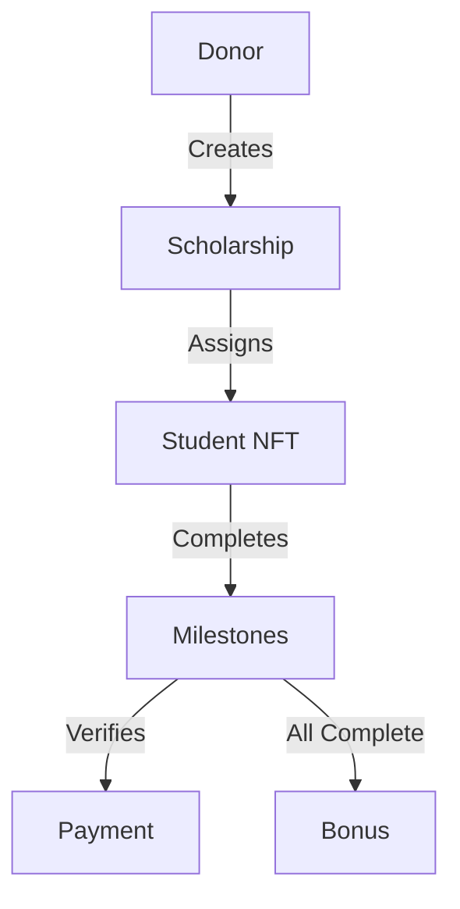

# StackScholar Smart Contract 🎓

A decentralized scholarship management system built on Stacks blockchain, enabling transparent and milestone-based educational funding.


## 📑 Overview

StackScholar is a smart contract that revolutionizes educational funding by creating a transparent, verifiable, and incentive-aligned scholarship system. It leverages blockchain technology and NFTs to manage educational scholarships with milestone-based fund distribution.

## ✨ Features

- **NFT-Based Scholarships**: Each scholarship is represented as a unique NFT
- **Milestone System**: Funds are distributed based on verified achievements
- **Bonus Incentives**: Additional rewards for completing all milestones
- **Donor Controls**: Comprehensive management tools for scholarship funders
- **Transparent Tracking**: Real-time visibility of scholarship progress
- **Revocation Safety**: Protection mechanism for unused funds

## 🔧 Technical Architecture

### Core Components



### Data Structures

- `scholarships`: Main mapping storing scholarship details
- `milestone-status`: Tracks completion status of individual milestones
- `scholarship-nft`: NFT representation of awarded scholarships

## 📋 Functions

### Administrative Functions

```clarity
(define-public (create-scholarship (milestones uint) (milestone-value uint) (bonus uint)))
(define-public (assign-scholarship (sch-id uint) (student principal)))
```

### Student Functions

```clarity
(define-public (claim-bonus (sch-id uint)))
```

### Verification Functions

```clarity
(define-public (verify-milestone (sch-id uint) (milestone-id uint)))
```

### Donor Controls

```clarity
(define-public (revoke-scholarship (sch-id uint)))
```

## 🔍 Error Codes

| Code | Description |
|------|-------------|
| `u100` | Exceeds maximum milestones |
| `u101` | Insufficient balance |
| `u102` | Unauthorized donor action |
| `u103` | Scholarship already assigned |
| `u104` | Invalid scholarship ID |
| `u105` | Inactive scholarship |

## 🚀 Getting Started

1. **Deploy Contract**
```bash
clarinet contract deploy StackScholar
```

2. **Create Scholarship**
```clarity
(contract-call? .StackScholar create-scholarship u3 u1000 u500)
```

3. **Assign Student**
```clarity
(contract-call? .StackScholar assign-scholarship u1 'ST1PQHQKV0RJXZFY1DGX8MNSNYVE3VGZJSRTPGZGM)
```

## 🔒 Security Considerations

- Funds are locked in contract until milestone completion
- Only authorized donors can verify milestones
- Revocation mechanism protects unused funds
- Student verification required for bonus claims


